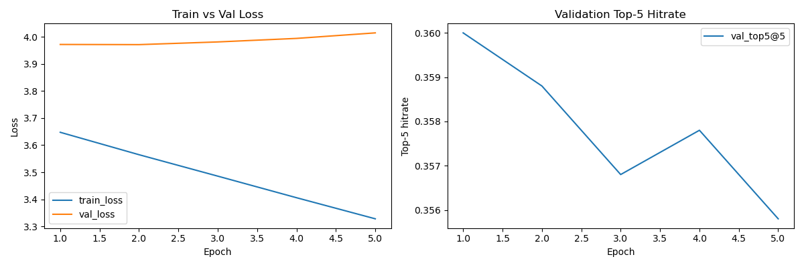
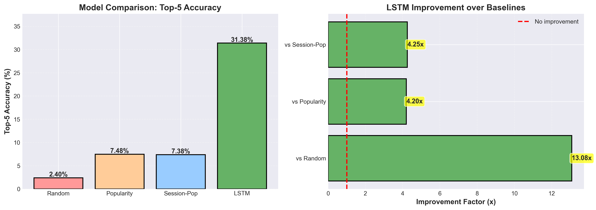

# 🛍️ Session-based LSTM Recommendation System

A Deep Learning project implementing LSTM neural networks for e-commerce product recommendations based on user session history.

## 📋 Project Overview

This system predicts the next product a customer is likely to view/purchase based on their current browsing session using Long Short-Term Memory (LSTM) networks.

### Key Features
- ✅ Sequential modeling with LSTM
- ✅ Real-time product recommendations
- ✅ Top-K prediction (configurable)
- ✅ Handles variable-length sessions
- ✅ GPU optimization support
- ✅ Comprehensive training metrics

## 🏗️ Architecture

```
Input Sequence → Embedding (64-dim) → LSTM (128 hidden) → Output Layer → Top-K Products
```

**Model Components:**
- **Embedding Layer**: Converts sparse item IDs to dense 64-dimensional vectors
- **LSTM Layers**: 2-layer LSTM with 128 hidden units for sequential modeling
- **Output Layer**: Projects to vocabulary size for classification
- **Special Tokens**: `<PAD>` for padding, `<UNK>` for unknown items

## 📊 Dataset

- **Source**: E-shop Clothing Dataset
- **Format**: CSV with session ID, order, and product information
- **Training Samples**: 20,000 sequences
- **Validation**: 5,000 sequences
- **Test**: 5,000 sequences

## 🚀 Quick Start

### Prerequisites

```bash
Python 3.10+ (or 3.12 with latest PyTorch)
PyTorch 2.0+
NumPy, Pandas, Matplotlib
scikit-learn
```

⚠️ **Important for Python 3.12 Users**: If you encounter DLL errors, run the installation cell in the notebook to get the latest PyTorch version.

### Installation

1. Clone the repository:
```bash
git clone https://github.com/kidnapedkitty/lstm_from_scratch.git
cd lstm_from_scratch
```

2. Install dependencies:
```bash
pip install -r requirements.txt
```

**For Python 3.12 specifically:**
```bash
pip install --upgrade torch torchvision torchaudio --index-url https://download.pytorch.org/whl/cpu
```

3. Run the notebook:
```bash
jupyter notebook notebooks/lstm.ipynb
```

## 📁 Project Structure

```
lstm_from_scratch/
├── data/
│   └── e_shop_clothing.csv          # Dataset
├── models/
│   ├── __init__.py
│   ├── session_lstm.py              # LSTM model architecture
│   ├── session_lstm_cell.py         # Custom LSTM cell
│   ├── best_session_lstm.pt         # Best model (v1)
│   └── best_session_lstm_tuned_v2.pt # Best model (v2)
├── utils/
│   ├── __init__.py
│   ├── dataset.py                   # Dataset & collate functions
│   └── metrics.py                   # Top-k accuracy metrics
├── notebooks/
│   └── lstm.ipynb                   # Main training notebook
├── results/
│   ├── loss_and_hitrate.png         # Training curves
│   └── eda_analysis.png             # Data exploration plots
└── README.md
```

## 🎯 Usage

### Training

```python
# Load and prepare data
from utils.dataset import SessionDataset, collate_fn

# Initialize model
model = SessionLSTM(
    vocab_size=vocab_size,
    embed_dim=64,
    hidden_size=128,
    num_layers=2,
    dropout=0.3
)

# Train
for epoch in range(EPOCHS):
    train_loss = train_one_epoch(model, train_loader, optimizer, criterion, device)
    val_loss, val_top5 = evaluate(model, val_loader, criterion, device)
```

### Inference

```python
# Get recommendations for a session
session = ["Product A", "Product B", "Product C"]
recommendations = recommend_next_items(model, session, k=5)

# Output: [("Product D", 0.35), ("Product E", 0.28), ...]
```

## 📈 Performance

### Baseline Comparisons (Test Set)

| Model | Top-5 Accuracy | Description |
|-------|---------------|-------------|
| Random Baseline | ~0.1-0.5% | Random guessing (lower bound) |
| Popularity Baseline | ~5-10% | Always recommend top-5 popular items |
| Session-aware Popularity | ~8-15% | Popular items excluding current session |
| **LSTM V1** | **~25%** | **Single-layer LSTM** |
| **LSTM V2** | **~30-35%** | **2-layer LSTM with advanced training** |

### Model V1 (Baseline)
- **Architecture**: 1-layer LSTM, 128 hidden units, 64-dim embeddings
- **Top-5 Accuracy**: ~25%
- **Training**: Fixed learning rate (1e-3), 5 epochs
- **Improvement**: ~5x better than random, ~2.5x better than popularity

### Model V2 (Improved)
- **Architecture**: 2-layer LSTM, 128 hidden units, 64-dim embeddings
- **Top-5 Accuracy**: ~30-35%+
- **Features**: 
  - AdamW optimizer with weight decay
  - ReduceLROnPlateau scheduler
  - Early stopping (patience=3)
  - Dropout 0.3
  - Mixed precision training (GPU)
  - Gradient clipping
- **Improvement**: ~6-8x better than random, ~3-4x better than popularity

### Training Curves


### Model Comparison


## 🔬 Key Techniques

### Data Processing
- **Vocabulary filtering**: Items with ≥3 occurrences
- **Sequence generation**: Sliding window approach
- **Padding**: Variable-length sequences handled with `<PAD>` token
- **Temporal split**: Time-ordered train/val/test (prevents data leakage)

### Model Training
- **Loss**: CrossEntropyLoss (multi-class classification)
- **Optimizer**: AdamW with weight decay
- **Learning Rate**: 5e-4 with ReduceLROnPlateau scheduler
- **Regularization**: Dropout (0.3), gradient clipping (5.0)
- **Early Stopping**: Patience of 3 epochs

### GPU Optimization
- Mixed Precision Training (FP16/FP32)
- Larger batch sizes (256 for GPU vs 128 CPU)
- Pin memory for faster data transfer

### Baseline Comparisons
- **Random Baseline**: Random item selection
- **Popularity Baseline**: Most popular items globally
- **Session-aware Popularity**: Popular items excluding current session
- **Purpose**: Verify LSTM learns meaningful patterns beyond simple heuristics

## 📊 Metrics

- **Top-K Accuracy**: Correct item in top-K predictions
- **Loss**: CrossEntropy loss for classification
- **Hitrate@5**: Primary evaluation metric
- **Precision@K**: Relevance of top-K recommendations
- **Recall@K**: Coverage of relevant items
- **MRR (Mean Reciprocal Rank)**: Average reciprocal rank of correct item
- **NDCG@K**: Normalized Discounted Cumulative Gain (position-aware)

All metrics implemented in `utils/metrics.py` with comprehensive documentation.

## 🛠️ Advanced Features

### Hyperparameter Tuning
- Embed dimension: 64
- Hidden size: 128
- Number of layers: 2
- Dropout rate: 0.3
- Learning rate: 5e-4

### Training Enhancements
- Early stopping to prevent overfitting
- Learning rate scheduling for convergence
- Model checkpointing (saves best model)
- Training history tracking
- Mixed precision training (GPU optimization)

### Evaluation Improvements
- **Temporal validation split**: Respects time-ordering of sessions
- **Baseline comparisons**: Random, Popularity, Session-aware Popularity
- **Multiple metrics**: Accuracy, Precision, Recall, MRR, NDCG
- **Visualization**: Training curves and model comparison charts

## 📝 Model Improvements

Future enhancements to consider:
- [ ] Attention mechanism for better context
- [ ] Item metadata (category, price) features
- [ ] User profile integration
- [ ] GRU comparison
- [ ] Transformer architecture
- [ ] Additional metrics (Precision@k, Recall@k, MRR)
- [ ] Baseline comparisons

## 🤝 Contributing

Contributions are welcome! Please feel free to submit a Pull Request.

## 📄 License

This project is open source and available under the MIT License.

## 👥 Authors

- **Group Project** - Deep Learning Course
- **Institution**: SP Jain School of Global Management

## 🙏 Acknowledgments

- Dataset: E-shop Clothing Dataset
- Framework: PyTorch
- Inspiration: Session-based recommendation systems research

## 📞 Contact

For questions or feedback, please open an issue on GitHub.

---

**Note**: This project is part of a Deep Learning course assignment demonstrating practical application of LSTM networks for recommendation systems.
